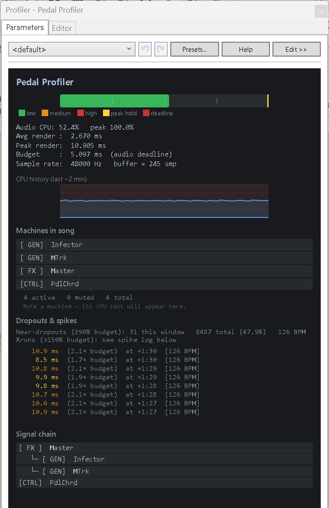

# Pedal Profiler

A real-time audio CPU profiler for [ReBuzz](https://github.com/wasteddesign/ReBuzz), implemented as a managed control machine.



## What it does

Pedal Profiler sits in your signal chain as a control machine and measures how much of your audio budget every other machine in the song is consuming — in real time, with no patching required.

Because ReBuzz calls control machines **first** in every audio buffer, the gap between our `Work()` returning and the next `Work()` starting is precisely the time all generators and effects consumed. This gives accurate CPU measurements without any hooks into ReBuzz internals.

### Features

- **Audio CPU bar** — green / orange / red load indicator with peak hold and deadline marker
- **CPU history sparkline** — ~2 minute rolling history
- **Per-machine cost bars** — mute any machine and Pedal Profiler automatically measures the before/after render time delta, showing the result as a labelled bar in ms next to each machine
- **Dropout counter** — tracks near-dropouts (≥90% of budget) per window and all-time
- **Spike log** — captures the last 8 distinct xrun events (>150% of baseline budget) with render time, ratio, and timestamp; 500ms cooldown prevents burst-flooding
- **Signal chain topology** — walks `m.Inputs` from Master backwards to show the full audio routing tree with depth indentation
- **Live machine list** — subscribes to `Song.MachineAdded` / `Song.MachineRemoved` for instant updates
- **Window parameter** — controls the averaging window (16–128 buffers); lower = more reactive, higher = smoother

## Requirements

- [ReBuzz](https://github.com/wasteddesign/ReBuzz)
- [.NET 10 Desktop Runtime (Windows x64)](https://dotnet.microsoft.com/en-us/download/dotnet/10.0)

## Installation

1. Build with `dotnet build -c Release` (or override the path — see below)
2. The DLL is automatically copied to `<ReBuzz>\Gear\Generators\`
3. Restart ReBuzz — **Pedal Profiler** appears in the Generators browser

```powershell
dotnet build PedalProfiler.csproj -c Release
# Override install path if ReBuzz is elsewhere:
dotnet build PedalProfiler.csproj -c Release /p:BuzzDir="D:\ReBuzz"
```

## How it works

```
[Our Work() START] ── trivial housekeeping ── [Our Work() END]
[Gen1 Work()]  [FX1 Work()]  [Gen2 Work()]  …  [FX_N Work()]
[Our Work() START again]  ← next audio buffer
```

- `otherMs  = thisStart − lastEnd`   → time ALL other machines took  
- `periodMs = thisStart − lastStart` → full audio buffer period  
- `CPU%     = otherMs / periodMs × 100`

A 128-buffer low-pass filter of `periodMs` gives the **baseline budget** used for spike detection and near-dropout counting, so late OS callback delivery doesn't mask genuine overruns.

### Per-machine measurement

Direct per-machine timing isn't available through the managed machine API. Instead, Pedal Profiler **polls `IsMuted`** every 100ms on the UI thread. When a mute state change is detected:

1. The current avg render time (`AvgOtherMs`) is snapshotted
2. A 1.5s stabilisation timer runs
3. The before/after delta in milliseconds is recorded against that machine's name
4. A colour-coded bar appears next to the machine (green <0.5ms, orange 0.5–1ms, red >1ms)

Note: if "process muted machines" is enabled in ReBuzz settings, muting won't save CPU and the delta will read ~0ms.

## Thread safety

| Thread | Responsibilities |
|--------|-----------------|
| Audio thread | Writes timing accumulators + atomic `volatile` reference swap of `ProfileSnapshot` |
| UI thread | Reads snapshot via `DispatcherTimer` + enumerates `Song.Machines` (never on audio thread) |

`Song.Machines` is an `ObservableCollection` with WPF change notifications — enumerating it from the audio thread can cause race conditions. All machine list access is on the UI thread only.

## License

MIT
